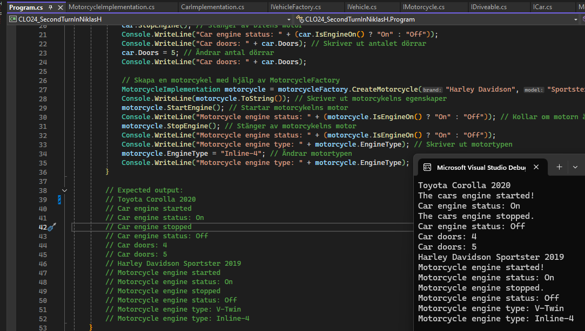

Namn: [Niklas Häll]

# Inlämningsrapport

Information
OBS!!! ändra absolut inte på rubrikerna i denna fil!!!!

## Inledning

### Hur uppfattade du uppgiften initialt?

Första intrycket var inte så trevlig, dokumentationen var rörig.
- Fragmenterad (samma information fast på olika sätt på olika ställen, för många sektioner).
- Mappar kallades upprepade gånger för "namespace", fast det är tydligt att vi jobbar i ett enda namespace så skapade det ett rörigt och väldigt komplext intryck.
- Lite nitpick, men om Clean Code är något vi skall sträva efter så borde klasserna heta CarImplementation och MotorcycleImplementation, inte "Impl". Jag döpte om dem.
- Vissa segment är förvirrande. "using Models" är tydligt, men "namespace Factories" är det inte. I det här fallet menades "WhateverNamespaceName.Factories". Otydligt.
- En del andra småfel som påverkar helhetsintrycket: i .md-filen Motorcycle.Impl har vi titeln "Car implementation", fyra filer har trasiga klassdiagram (unable to render rich display - CarImpl.md, ICar.md, Imotorcycle.md, IVehicle.md), och slutligen så har reflections.md-filen problem med teckenuppsättningar: å, ä och ö står som �.

Ovanstående var första-intrycket, det var lite som när vi kör bil i dimma. Jag såg vägmarkeringarna och förstod var jag skulle, men sikten grumlades av störande element. När det gäller själva uppgiften så tyckte jag den var tydlig: Vi har färdig kod och instruktioner för arkitekturen, så det är bara att skapa layouten, lägga in elementen och sedan börja knyta ihop dem.

Här kommer direkt en varningsklocka från erfarenhet från tidigare uppgifter: Det är alltid lättast att bygga element ett i taget, och se till att hålla bort alla varningar och felmeddelanden direkt. Det är mycket lättare att felsöka och revertera en implementation som blivit fel.

I detta projekt är det naturligt att börja med att lägga in Program-koden med Main-segmentet direkt, och då kan det lätt bli rörigt om vi skall lägga till en klass/interface/metod i taget, vi kommer inte kunna köra main om inte hela layouten finns! Det är också väldigt svårt att jobba i någon annans kod, innan du satt dig in i den.

Nu kommer vi till planering/genomförande ->

--- Skriv ovanför och ta inte bort denna raden ---

## Planering och genomförande

### Vilka steg tog du för att lösa uppgiften?

Intro: Som nämnts ovan så tänkte jag igenom riskerna med att skapa hela projektet vs att jobba modulärt. Det är alltid önskvärt att jobba modulärt. Eftersom vi egentligen har ett större ramverk redan så valde jag att skapa alla klasser och interface först, de kan ju finnas utan kod initialt och sedan bygger vi på därifrån. Vid behov kan jag kommentera bort kod i Program/Main och sedan arbeta "modulärt" på det här sättet.

1. läste igenom allt inlämningsmaterial för att få en övergripande bild

2. Skapade mapp- och filstrukturen och började ta grundtemplates från materialet vi hade tillgång till. Vi hade ju punkten "Steg-för-steg-arbetsgång" så de klasserna skapade jag tidigt.

3. Satte upp en ny github-repository och initialiserade projektets mapp genom bash (git init, git remote add origin etc)

4. Började dokumentera i denna fil, och valde sedan att omgående brancha mitt privata repository till att göra ett internt repo inom CLO24 istället.

5. Skapade properties och metoder i CarImpl.cs

6. Skapade en branch, feature/creating-mechanics och började jobba i den

7. Kopierade koden från CarImpls.cs till MotorcycleImpl.cs och modifierade den för att passa bättre till en motorcykel.. passade på att byta Impl till Implementation, så vi håller Clean Code så gott vi kan.

8. Jag kom hit innan jag hittade den smått gömda filen project.md! Där finns steg för steg-guider som mer eller mindre visar på allt jag skrev ovanför, haha. Nu är det dags för buggfixande, jag har 6 st errors och 0 warnings. Det var följande:
- CS0246, råkade göra ett ínt istället för int!
- CS0738, kunde inte implementera ICar.Doors för att int var felstavat, se ovan.
- CS1061, saknade metoderna CreateCar och CreateMotorcycle

9. Testkör programmet:


10. Det funkade bra! Så nu ville jag bara testa att printa ut Drive()-metoden med:


11. Eftersom vi hade fyra metoder som var gemensamma så återanvände jag dem:
IsEngineOn, StartEngine, StopEngine, Drive. De samlade jag i en klass som jag kallade VehicleFoundation. Det blev mycket mindre kod och mer kontroll med alla metoder i en.

12. Uppdaterade Readme.md

13. Nu har vi ett fungerande program som kan köra Program.cs. Vi skulle inte ändra interfacet, och det gjorde jag inte men har valt att använda VehicleFoundation, som nämns i punkt 11. Vi anropar IVehicle. Nästa steg är att se hur vi kan optimera koden utan att göra den alltför abstrakt och oläsbar! I det här läget kollar jag med ChatGPT vad den tycker om koden enligt Clean Code-principer:

- Här ger även ChatGPT ett par förslag till "förbättringar" av koden, se punkt 2 under implementeringsval!

14. Clean Code: Sätter default values för att undvika null i CarImplementation och MotorcycleImplementation-konstruktorerna.

15. Inkapsling A: Konstruktorn VehicleFoundation public -> protected. Klasserna MotorcycleFactory och CarFactory var redan internal, men satte även metoderna där internal.

16. Inkapsling B: Det här blir ett rejält ingrepp i koden! Jag vill göra alla properties private set, så de inte kan modifieras utifrån. För att kunna göra dem "private set" samtidigt som jag jobbar med interface så skapar vi ett mellansteg där Brand, Model, Year, Mileage får bli InternalBrand, etc. I konstruktorn VehicleFoundation så gör vi sedan InternalBrand = brand, etc.
- Som en följd av detta behöver vi även justera koden på rätt många ställen: Brand får heta InternalBrand, etc. Se utmaningar punkt 4.

17. Refaktorering av Main: Vi gör flera funktioner för varje fordon vi printar, det går att bryta ner i metoder för att hålla Program/Main mer ren. Skapade metoderna:
- CreateAndDisplayVehicles: Skapar instanserna och kör metoderna för att skapa fordon
- CreateVehicle: Skapar fordon
- DisplayVehicleDetails: Printar ut informationen om varje fordon

18. Skapade VehicleTypeName i VehicleFoundation. La till raden nedan i Car/Motorcycle där de justerar Vehicle till Car eller Motorcycle.
```cs
protected virtual string VehicleTypeName => "Vehicle";
```
Detta gör att jag kan printa ut fordonstypen på ett lätt/snyggare sätt. När jag justerade ToString() i VehicleFoundation-klassen skulle jag kunnat lägga till fordonsspecifika detaljer som till exempel Door (Car) eller EngineType (Motorcycle). Det är en möjlighet att få programmet att växa där senare.

19. Mergeade branchen med main. Nu har vi ett bra program som funkar med refaktorerade metoder i Main, och vi har kommit till steg 13 i project.md-filen vi jobbar efter: Polymorfism. Steg ett där är att "döda" vår Main och skapa en ny. Så jag skapar en helt ny branch för detta, då har vi kvar feature/creating-mechanics som vi kan återskapa om vi behöver. Nu gör vi feature/endgame.

20. Det här är en större punkt eftersom det är en partiell re-write av Program.cs. Jag skriver ner de justeringar jag gjort nedan:
- Skapar metoden CreateVehicleList: här lägger vi till fordon
- Skapade en List som använder information i IVehicle och tar emot vehicles.Add
- Skapar metoden DisplayAllVehicles(vehicles) som skriver ut ovanstående lista
- Sedan kommer Fabriken:
IVehicle CreateVehicle(CarFactory, bilspecifika parametrar)
IVehicle CreateVehicle(MotorcycleFactory, motorcykelspecifika parametrar) etc
Den fabriken går att utöka såklart, jag planerar att lägga till Truck eller Bus.
- Skapar metoden DisplayVehicleDetails: skriver ut till konsollen

21. Skapar dokumentet factorystructure.sql och bifogar i Docs-foldern. Fick hjälp av ChatGPT.

22. NÖRD DELUXE! Jag har gjort en random-shuffle-List som printar fordonen i random order.. mest för att det är kul. Ville också göra något som kanske ingen annan gör. Använde Fisher-Yates algoritm. Skälet: Jag vet hur jag gör en Random rng = new Random(), men jag ville ha en enkel algoritm som kan cykla igenom vår List av fordon. Bad ChatGPT om en lösning; den här byter plats på objekten så den går att köra som en "sorteringsalgoritm" i en egen metod! Snyggt! Har kommenterat den rad för rad i programmet om någon skulle undra vad den gör.

23. Koden komplett, vi skulle kunna lämna in det nu, men jag vill gärna visa att verktygen fungerar och skapa något annat så jag lägger till fordonet Tractor.
- ITractor.cs, TractorImplementation.cs, TractorFactory.cs och den nödvändiga koden i Program.

24. Nu får koden anses vara komplett, men vill bara visa på ytterligare en färdighet för att avsluta detta: Ville lägga till en fordons-specific metod till, så åtminstone en av dem har två. Det vore tråkigt att lägga till en generisk färg (den påverkar alla) så jag skapade vikt i ton på traktorn.

--- Skriv ovanför och ta inte bort denna raden ---

## Utmaningar och lösningar

### Vilka utmaningar stötte du på under projektet?

1. Den absolut första utmaningen var att jobba med färdig kod och en layout som jag inte skapat själv.

2. Den andra utmaningen var att jag råkade skapa en copy efter jag gjorde en fork i Git, så jag hade en extra kopia av projektet nestlad inuti min mappstruktur.

3. När jag slog ihop fyra metoder till VehicleFoundation.cs så fick jag varningar om non-nullable-deklarationer (CS8618). De låg i properties från IVehicle när de initialiseras.

4. Ny instans av Brand, Model etc. Detta skapar följproblem i formen av: Vi kan inte fritt använda Ctrl+R och byta namn på alla, vi har ju nästlat in originalvariabeln bakom skydd, men här är felkodsrutan och/eller ChatGPT väldigt väldigt bra hjälpmedel.

5. Följproblem av ovan instansiering: Nu när vi inte Drive()-metoden.

6. Noterade att "modify"-linjen på doors/engine är statisk. Vi kan använda en sträng för vehicles och sedan genom faktory-metoden göra skillnad på bil/mc/etc, men modify-strängen ligger som en separat repeterad kodsträng, och t ex så blir alla modifierade dörrar 5 st och alla modifierade motorer Inline-4..

7. Följdproblem på ovanstående: Koden ger inga felmeddelanden men den slumpar ändå inte fram en modifikation.

--- Skriv ovanför och ta inte bort denna raden ---

### Hur löste du dessa utmaningar?

1. Jag läste noga igenom dokumentationen flera gånger och skapaden en plan för implementation steg-för-steg

2. git -ls -la och sedan rm -rf (namnetpåmappen). Det hade säkert gått lika bra att bara deletea mappen direkt i Windows, men vill ha för vana att använda Bash och CLI.

3. Det finns två lösningar: Antingen följande
```cs
public string Brand { get; set; } = string.Empty; // Defaults to an empty string 
```
Eller så löser vi det genom att skapa en konstruktor som sätter default-värden för Brand, Model, Year och Mileage (det gör vi i M- och CarImplementation.cs idag). string.Empty är en enkel lösning, det endra gör mindre återanvändning av kod men den blir svårare att läsa och jobbigare om vi skall in och pilla i koden. Jag väljer string.Empty-lösningen!

4. Jag fick 15 errors bara av denna lilla justering, men kopierade/klistrade hela felkodsrutan och frågade bara ChatGPT var jag behöver justera namnen på grund av den nya instansieringen. Ett annat alternativ hade varit att klicka varje felkod för att komma till rätt kod och justera den vägen.

5. Det går att instansiera den i Program/Main, exempelvis:
```cs
IDriveable driveableCar = (IDriveable)car;
```
Men dels så blir det väldigt grötigt i Main (inte särskilt Clean Code!), dels fanns det en enklare lösning: Vi extendar IVehicle från public interface IVehicle till public interface IVehicle : IDriveable.

6. Jag ser flera lösningar:
- Specifik modifikation: för varje fordon direkt i Program-klassen när fordonet skapas. Nackdel: Det blir repetativt om vi har många fordon.
- Randomiserad modifikation: Skapa en List för Door, en för EngineType, etc, och välj ett randomiserat värde från listan. Dynamiskt och intressanta variationer. Nackdel: Inte särskilt realistiskt kanske om en 100cc-MC får en Honda CBX 6-cylindrig motor..
- En kul grej? Vore om vi kunde återanvända ShuffleList, vi har redan den i Program för att randomisera vilken ordning vi presenterar fordonen. Kan vi använda även till detta? Träna på återanvända kod?
- Lösningen till slut!
Jag skapade metoden ApplyVehicleModifications, det är två statiska listor (door modification har 2, 3, 4, 5 dörrar och engine har fyra olika motoralternativ).
- Den återanvänder koden från ShuffleList! Mycket nöjd!

7. Bytte ut följande kod med koden nedanför:
```cs
car.Doors = carDoorModifications[new Random().Next(carDoorModifications.Count)];
// Ny kod nedanför
car.Doors = carDoorModifications[tempRandom.Next(carDoorModifications.Count)];
```
- Skillnaden är att vi skapar en separat ny random-instans för varje gång vi randomiserar koden, det kan ställa till det när vi kör ShuffleList simultant. Tog även bort den hardkodade default-värdet som jag satt i DisplayVehicleDetails. Dels skriver den över det slumpade värdet, dels så är den överflödig för vi slumpar ändå fram ett värde till variabeln..

--- Skriv ovanför och ta inte bort denna raden ---

### Beskriv några implementeringsval du gjort?

1. TO DO: BESKRIV VEHICLEFOUNDATION-TANKEN HÄR

2. ChatGPTs förslag till refaktorerings-optimisering:
- Den föreslår "constructor chaining", dvs jag skapar en konstruktor i CarImplementation som kallar på klassens konstruktor. Det ger en väldigt "clean" CarImplementation:
```cs
namespace CLO24_SecondTurnInNiklasH.Models
{
    using Interfaces;

    public class CarImplementation : VehicleFoundation, ICar
    {
        // Property specific to Car
        public int Doors { get; set; }

        // Constructor to initialize properties, calling the base class constructor
        public CarImplementation(string brand, string model, int year, double mileage, int doors)
            : base(brand, model, year, mileage)
        {
            Doors = doors;
        }

        // Additional car-specific methods can be added here if needed
    }
} ```


--- Skriv ovanför och ta inte bort denna raden ---

## Reflektion och utvärdering

### Vad lärde du dig genom att genomföra projektet?

--- Skriv ovanför och ta inte bort denna raden ---

### Vilka möjligheter ser du för framtida projekt baserat på denna erfarenhet?

--- Skriv ovanför och ta inte bort denna raden ---